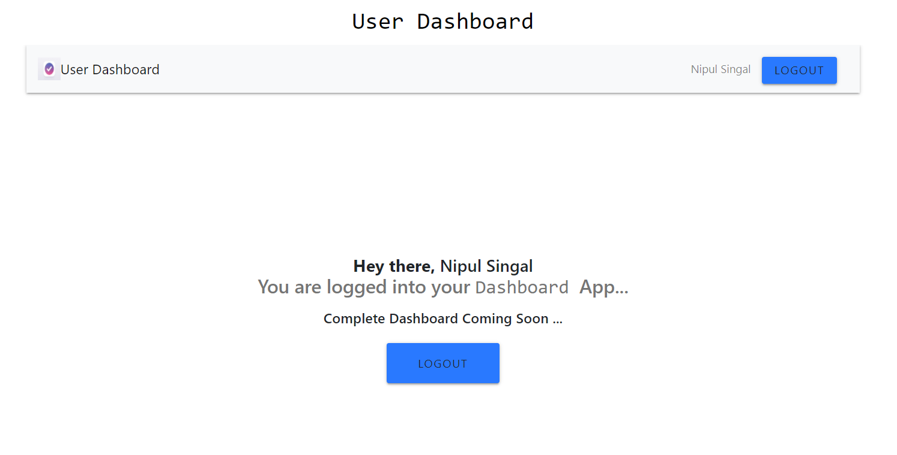
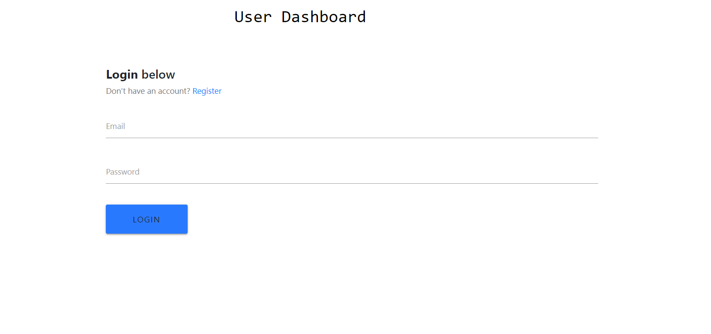
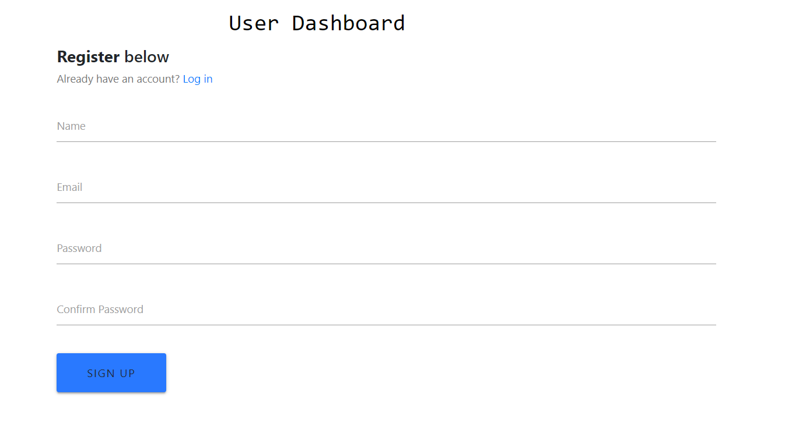

<h1 align="center">User Dashboard</h1>

<p align="center">


</p>



<h2 align="center"><a  href="https://serene-cove-78437.herokuapp.com/">Visit the Site</a></h2>

## Setup -

> This project is made using **React.js**. So make sure you have **Node** installed before deploying it locally.

```
git clone
npm install
cd client
npm install
cd ..
npm run dev
Website - localhost:3000
```

## Glimpses

## Login Section 👓



## Register Section :collision:



> Copyright to NipulSingal
